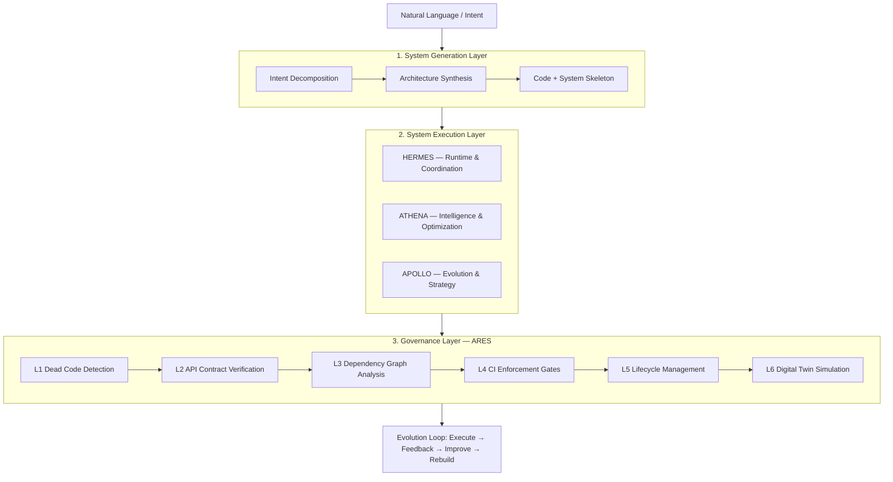
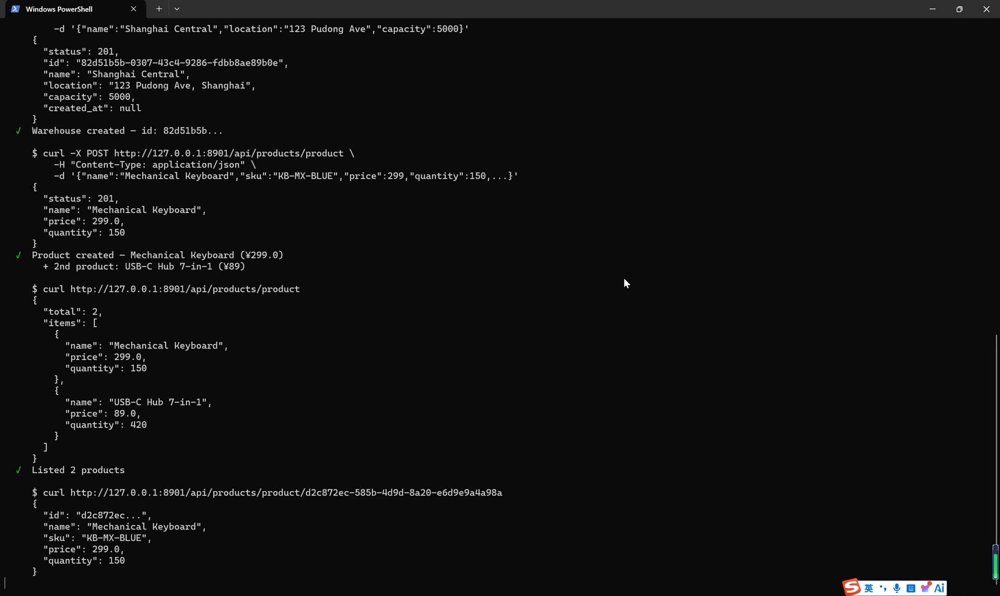
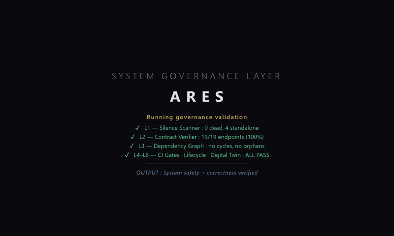

# Hi, I'm Yuxue Chen

**AI Systems Architect | Autonomous System Generation & Governance**

I build systems that generate, execute, and govern other systems — not chatbots, but autonomous software ecosystems.

---

## Evidence: ZEUS Framework

| Metric | Value |
|--------|-------|
| Python modules | **1,389** |
| Total LOC | **387,413** |
| Tests | **9,094** collected |
| Commits | **310** |
| Build iterations | **360+** |

### Runnable Output — CodeGen Engine

ZEUS generates complete runnable applications from one-sentence requirements:

| Generated Project | Modules | REST Endpoints |
|-------------------|---------|---------------|
| customer_support | 4 (Tickets/Email/WeChat/Notifications) | 19 |
| restaurant_ordering | 3 (Menu/Tables/Kitchen) | 15 |

Each includes: database schema → business logic → REST API → HTMX admin panel. Fully runnable.

### ARES Governance — Audit Baseline

| Check | Result |
|-------|--------|
| SilenceScanner | 0 dead / 156 standalone / 0 island |
| Contract Verifier | **100%** (80/80 verified) |
| Health Score | **100 / 100** |
| Debt Tracker | 0 items |

---

## Architecture

---

## Demos

### One Sentence → System (CodeGen Engine)

*34s terminal recording. One sentence in — 28 files, REST API, Admin Panel. Real code running.*

### Architecture Walkthrough (ZEUS Framework)

*60s — 3-layer architecture: System Generation → System Execution → System Governance (ARES).*

---

## Open Source Components

- **[dead-scanner](https://github.com/Nick-lll/dead-scanner)** — Python module classifier (dead / fake-alive / standalone / island). Zero dependencies. `pip install dead-scanner`
- **[contract-verifier](https://github.com/Nick-lll/contract-verifier)** — Bidirectional AST-to-contract compliance checker. Zero dependencies. `pip install contract-verifier`

Both extracted from ZEUS ARES Engine. Runnable, documented, on PyPI.

---

## What makes ZEUS different

Most AI systems generate outputs. ZEUS generates **entire systems** — then governs them through a layered control architecture.

The shift: from *"AI as a tool"* to *"AI as a system creator and controller."*

---

## Contact

- Email: nickchen791@gmail.com
- GitHub: [github.com/Nick-lll](https://github.com/Nick-lll)
- X: [@Nicksenlin](https://x.com/Nicksenlin)
