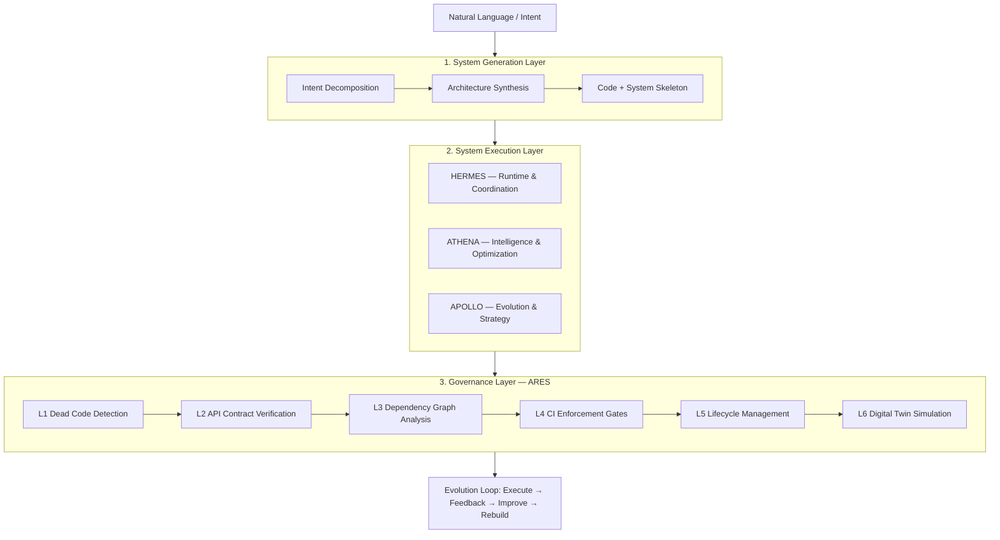
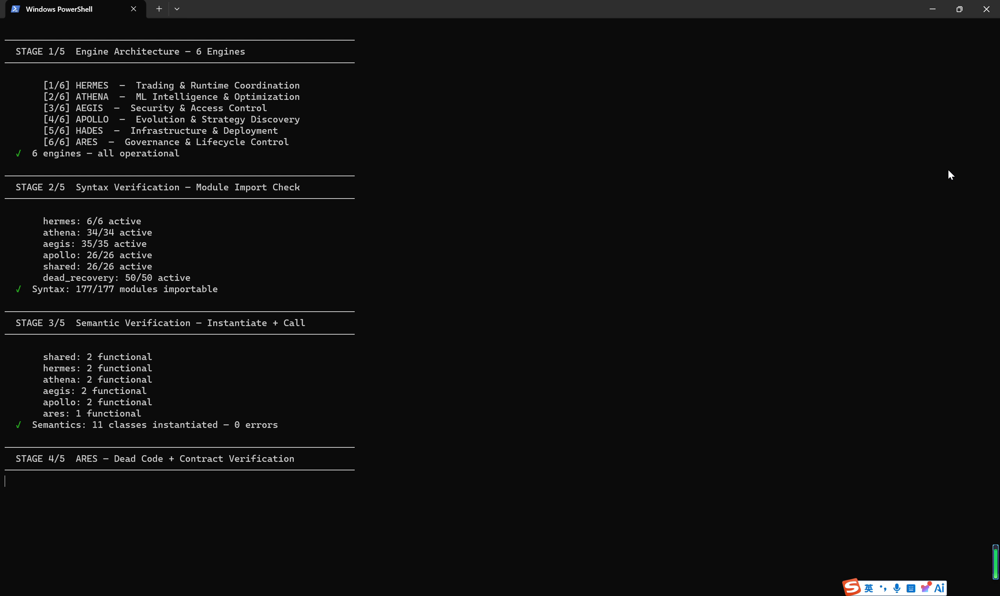

# ZEUS — A System Compiler for Autonomous Agents

> ZEUS generates, executes, and governs multi-agent software systems.
> It turns LLMs from conversational models into controllable system-level executors.
>
> Not a chatbot framework. A system compiler.

[Full Executive Summary →](EXECUTIVE_SUMMARY.md)

---

## The Problem

AI agents today are uncontrollable, non-deterministic, and lack lifecycle governance. We build them as **behaviors**, not as **systems**. When they break, we don't know why. When they rot, we don't notice.

## The Approach

Three layers, one system:

---

## Evidence — Runnable, Verifiable

### 1. One Sentence → Running System

One sentence in. 28 files, database schema, REST API, HTMX admin panel out. Real code, real runtime.

*34s — One sentence to 28 files, REST API + Admin Panel.*

### 2. Full System Runtime

177/177 modules operational across 6 engines. ARES audit running live. Not a mockup.

*41s — 6 engines operational, ARES audit, real ZEUS running.*

### 3. Architecture Walkthrough

The 3-layer design: Generation → Execution → Governance. How the layers connect and why.

*60s — 3-layer architecture walkthrough.*

---

## Generated Systems (Runnable)

ZEUS generates complete applications. Each includes: database schema → business logic → REST API → HTMX admin panel.

| Generated Project | Modules | REST Endpoints |
|-------------------|---------|---------------|
| [customer_support](https://github.com/Nick-lll/customer_support) | 4 (Tickets/Email/WeChat/Notifications) | 19 |
| [restaurant_ordering](https://github.com/Nick-lll/restaurant_ordering) | 3 (Menu/Tables/Kitchen) | 15 |

---

## Open Source Components

Extracted from ZEUS ARES Engine. Zero dependencies, on PyPI, documented.

- **[dead-scanner](https://github.com/Nick-lll/dead-scanner)** — Python module classifier (dead / standalone / island). `pip install dead-scanner`
- **[contract-verifier](https://github.com/Nick-lll/contract-verifier)** — AST-to-contract bidirectional compliance checker. `pip install contract-verifier`

---

## ARES Governance — Audit Baseline

| Check | Result |
|-------|--------|
| SilenceScanner | 0 dead / 156 standalone / 0 island |
| Contract Verifier | **100%** (80/80 verified) |
| Health Score | **100 / 100** |
| Debt Tracker | 0 items |

---

## What Makes ZEUS Different

Current agent frameworks (LangGraph, AutoGPT, CrewAI) operate at the **workflow execution** level — they help you write agent pipelines.

ZEUS operates at the **system generation and governance** level:

| Framework | Generates Systems? | Runtime Governance? | Lifecycle Management? | Contract Verification? |
|-----------|-------------------|--------------------|--------------------|------------------------|
| **ZEUS** | **Yes** | **Yes (ARES)** | **Yes** | **Yes** |
| LangGraph | No | No | No | No |
| AutoGPT | No | No | No | No |
| CrewAI | No | No | No | No |

The shift: from *"AI as a tool"* to *"AI as a system creator and controller."*

---

## Contact

- Email: nickchen791@gmail.com
- GitHub: [github.com/Nick-lll](https://github.com/Nick-lll)
- LinkedIn: [linkedin.com/in/yuxue-chen](https://linkedin.com/in/yuxue-chen)
- X: [@Nicksenlin](https://x.com/Nicksenlin)
